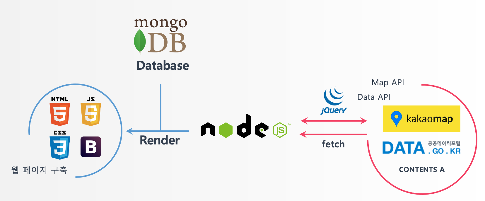

# Index

1. [About the project](#about-the-project)
2. [Getting started](#getting started)
2. [Features](#features)
3. [Roadmap](#roadmap)
4. [Architecture](#architecture)
4. [Contributing](#contributing)
5. [Contact](#contact)

## About the project

휴게소 정보 제공 서비스

고속도로 휴게소들의 정보를 제공하는 서비스입니다.

휴게소의 먹거리 메뉴들과 날씨, LPG 충전소의 정보를 제공합니다.

게시판을 이용해 사용자 간 실제 사용 정보 등을 나눌 수 있습니다.

## Getting started

1. 저장소불러오기

```git clone http://khuhub.khu.ac.kr/2018102164/rest_stop_list.git```
2. npm 설치

```    npm install```

## Feautres
- 고속도로 별 경로 휴게소 위치 표시
- 휴게소 식당 메뉴
- 휴게소 별 날씨
- LPG 충전소 여부
- 회원가입 및 로그인
- 게시판

## Roadmap
1. build server (nodejs &express)
2. adapt css (bootstrap)
3. add map api for highway & rest stop (kakao map api)
4. connect database(mongoose)
4. fetch api for rest stop weather, food menu and LPG gas station
5. add login/sign up
6. continue...


## Architecture


## Contributing
please follow the steps below for contributing this Project
1. git fork
2. create branch from master
3. modify project
4. commit & merge request


## Contact
- 지창언 gentleking95@khu.ac.kr
- 김민규 min1925k@khu.ac.kr
- 이서현
